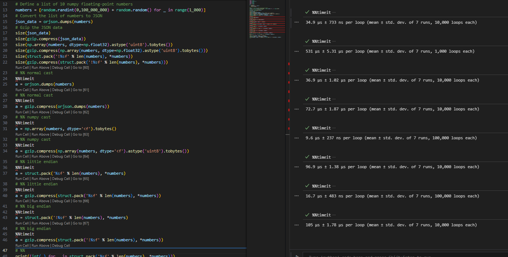
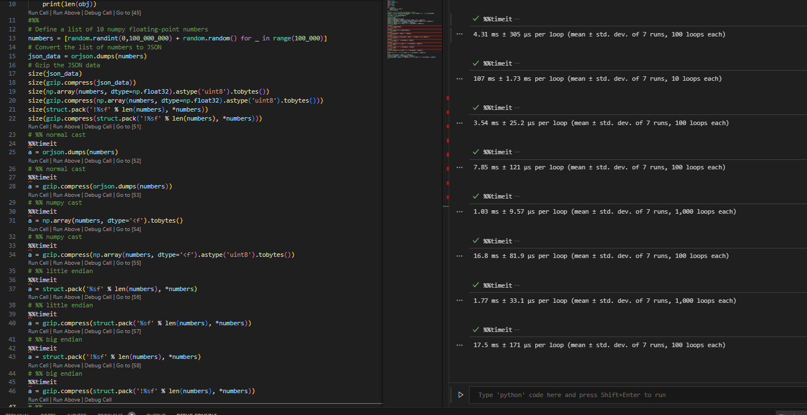
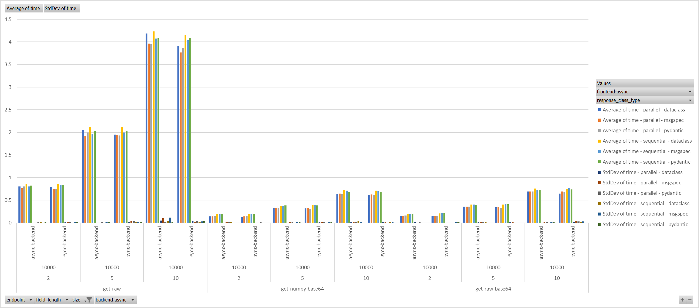

# Python Parse Speed

I wanted to test out how to parse faster a lot of tabular data inside a json from fastapi server.

So I started with `main.py` file to determend the speed of parsing the data and if I should go deeper into testing it, answer `YES`.

Example of 1k random data:


Example of 100k random data:


I've created a `server.py` file to test the speed of parsing the data from a fastapi server. In the server there is the same function to generate random numbers between 0 and 1 million, as floats using numpy (because this is not the main point of the test) and then returning the data as a json.

I also encluded Gzip because in a real world scenario, the data would be compressed. always.

There are 6 endpoints in the server, that return the same data in different ways:

- /get-raw - returns the data as is
- /get-numpy-base64 - returns the data as a base64 encoded by `numpy.asbytes()` and `base64.encodebytes()`
- /get-raw-base64 - returns the data as a base64 encoded by `struct` and `base64.encodebytes()`
- /async-get-raw - same as /get-raw, but async function
- /async-get-numpy-base64 - same as /get-numpy-base64, but async function
- /async-get-raw-base64 - same as /get-raw-base64, but async function

all functions gets the same input:

- `size` - the size of each array in the data
- `seed` - the random seed to use
- `fields` - fields of which i will return the data in

Responses are in json format and look like this:

- `data` - the data, as key value pairs, the value is a list of floats or base64
- `request` - the request parameters, in array times 10, act as extra data to parse, in a real world scenario, this would be as extra data return with the tabular data

## TL;DR



The results here are for various sizes of data:

- field size of 2, 5, 10
- data size of 100, 1k, 10k
- parallel vs sequential
- async vs sync (in fastapi)
- seed: 42

each combination is tested 5 times with 20 iterations each, the seed is the same for all tests.

## Installation

### Prerequisites

- Python 3.8 or higher
- pip

### Installing

1. Clone the repository to your local machine.
2. Navigate to the project directory.
3. Create a virtual environment:

```sh
python -m venv venv
```

4. Activate the virtual environment

- On Windows

```sh
.\venv\Scripts\activate
```

- On Unix or MacOS:

```sh
source venv/bin/activate
```

5. Install the required packages:

```sh
pip install -r requirements.txt
```

6. Run the server:

```sh
python server.py
```

7. Open `page.html` in your browser to interact with the application.

The `page.html` file is a simple HTML file that uses JavaScript to make test manually the seepd of parsing the data.

There is also a usage of webworkers to test the speed of parsing the data in a separate thread, becasue the parsing is a CPU bound operation.

### To generate the graph

1. Run the server:

```sh
python server.py
```

2. Run the server-test.py script:

```sh
python server-test.py
```

3. Wait for the code to complete, should take a few minutes.

4. Open the `server-test.csv` using excel to the results.

5. Pivot the table to your liking. :)
